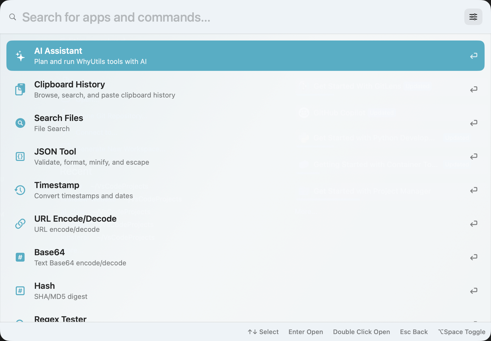

# WhyUtils

A Raycast-style launcher for macOS, built with SwiftUI.

WhyUtils combines a fast command palette with practical local tools: clipboard history, file search, text/data utilities, system actions, and an OpenAI-compatible AI assistant that can chat or invoke local tools depending on the configured access mode.

## Preview



Launcher-first UX, local utilities, and an AI assistant live in the same command surface.

## Features

- Fast launcher panel with keyboard-first navigation
- Global hotkey to show or hide the app
- Clipboard history with quick paste-back automation
- Local file search with Finder reveal and direct open
- Built-in utilities for:
  - JSON formatting and validation
  - Timestamp conversion
  - URL encode/decode
  - Base64 encode/decode
  - Hash generation
  - Regex testing
- Search shortcuts for apps, system settings, and web search
- AI Assistant with:
  - OpenAI-compatible API support
  - Custom `baseURL`, `apiKey`, and `model`
  - Local chat session history
  - Multimodal image input support
  - Access modes for bounded tools vs. higher-permission local actions
- English and Chinese UI
- Launch-at-login support

## Core workflows

- Open the launcher and jump directly to a tool, app, file, or system setting
- Search recent clipboard history and paste content back into the previous app
- Run quick text transformations without leaving the keyboard
- Use the AI Assistant for chat, image input, or local tool execution through an OpenAI-compatible provider

## Why this project exists

WhyUtils started as a lightweight personal macOS utility launcher, but the goal is broader than a single-purpose shortcut panel. The app is meant to be a compact desktop toolbox: fast to summon, easy to extend, and useful for everyday developer and productivity workflows.

## Requirements

- macOS 12+
- Xcode or Command Line Tools with Swift Package Manager support

## Development

Run the app in development mode:

```bash
swift run whyutils-swift
```

Run the test suite:

```bash
env CPLUS_INCLUDE_PATH=/Library/Developer/CommandLineTools/SDKs/MacOSX.sdk/usr/include/c++/v1 swift test
```

## Build a local app bundle

```bash
./scripts/build_app.sh
open dist/whyutils-swift.app
```

The default build is intended for local use and uses ad-hoc signing.

If you want to build with a specific signing identity:

```bash
WHYUTILS_SIGN_IDENTITY="Developer ID Application: Your Name (TEAMID)" ./scripts/build_app.sh
```

If you want to skip signing entirely:

```bash
WHYUTILS_SIGN_MODE=none ./scripts/build_app.sh
```

## Permissions

Some features depend on macOS permissions:

- Accessibility: required for reliable paste-back automation
- Automation / Apple Events: required for some app and system integrations

Because ad-hoc signatures can change between builds, macOS may treat a rebuilt app as a new binary and ask for permissions again.

## Distribution and notarization

For distribution outside your own machine, use the notarization flow:

```bash
xcrun notarytool store-credentials "whyutils-notary" \
  --apple-id "<APPLE_ID>" \
  --team-id "<TEAM_ID>" \
  --password "<APP_SPECIFIC_PASSWORD>"
```

Then build and notarize:

```bash
WHYUTILS_SIGN_IDENTITY="Developer ID Application: Your Name (TEAMID)" \
WHYUTILS_NOTARY_PROFILE="whyutils-notary" \
./scripts/notarize_release.sh
```

## Keyboard shortcuts

- `⌘⇧Space`: show or hide the launcher by default
- `↑` / `↓`: move selection in the launcher
- `Enter`: open the highlighted result
- `Esc`: return to launcher or dismiss the current surface
- `⌘Enter` in file search: reveal the file in Finder

## Project status

WhyUtils is actively evolving. The current focus areas are:

- polishing the AI Assistant UX
- improving launcher quality and local integrations
- making the project easier to build, extend, and ship as a real macOS utility

## Contributing

Issues and pull requests are welcome.

If you want to contribute, the most useful areas right now are:

- launcher ranking and search behavior
- macOS permission and automation reliability
- UI polish and accessibility
- AI tool execution safety and UX
- build, signing, and distribution workflow improvements

## Codebase notes

A compact architecture/context index is available at:

- [`docs/CODEBASE_CONTEXT.md`](docs/CODEBASE_CONTEXT.md)

## License

MIT. See [`LICENSE`](LICENSE).
